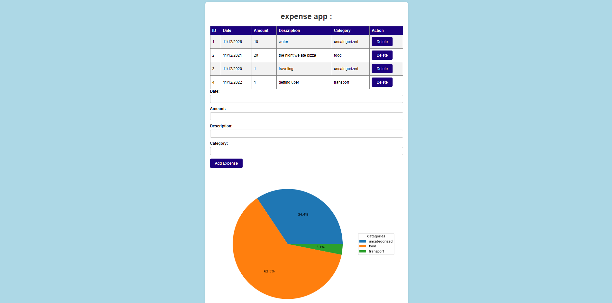

# Expense Tracker # Live url: https://expense-tracker-tkns.onrender.com

A full-stack expense tracking web app built with Flask, featuring automatic expense categorization and visual spending breakdowns.

## Screenshot



## Features

- Add and delete expenses
- Automatic categorization based on expense description (keyword matching)
- Live pie chart of spending by category
- Clean, styled interface

## Tech Stack

- **Backend:** Python, Flask
- **Database:** SQLite
- **Data Visualization:** Matplotlib
- **Frontend:** HTML, CSS, Jinja2

## Running Locally

1. Clone the repository

   ```
   git clone https://github.com/DRAG-dev01/expense-tracker.git
   cd expense-tracker
   ```

2. Install dependencies

   ```
   pip install -r requirements.txt
   ```

3. Run the app

   ```
   python app.py
   ```

4. Open `http://127.0.0.1:5000` in your browser

## Author

Made by [Kian Asef](https://github.com/DRAG-dev01)
